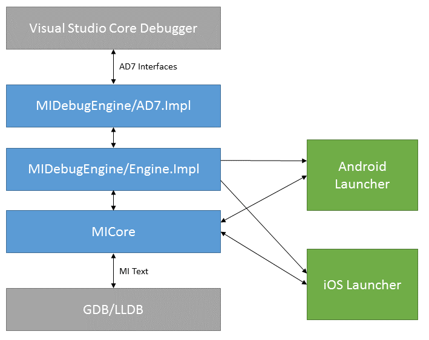

Let's dig into how the MIEngine is put together. To start, here is an architectural diagram for the various parts of the MIEngine:

The 'Visual Studio Core Debugger' and 'GDB/LLDB' are the two parts of the diagram that are external to this project.

The Visual Studio Core Debugger box represents the Visual Studio UI, and the rest of the core Visual Studio debugging logic. This will call into the MIDebugEngine through the AD7 interfaces (IDebugEngine2, IDebugProgram2, etc). The MIDebugEngine will also call back into AD7 interfaces to send events (ex: a breakpoint was hit) or in some cases to obtain the objects needed to fulfill the contracts of the AD7 interfaces (ex: to obtain an IDebugProcess2 from the SDM for the newly launched process).

MIDebugEngine/AD7.Impl is the top layer of the MIEngine. This structure of having a layer of the debug engine to implement AD7 is inherited from the [Debug Engine Sample](https://code.msdn.microsoft.com/Visual-Studio-Debug-Engine-c2e21c0e) which is the bases for this project. This layer contains the code required to implement the AD7 interfaces. If you want to dig into this layer more, the debug engine sample contains documentation on how debug engines work.

MIDebugEngine/Engine.Impl is where most of the smarts of the MIEngine lives. It presents an object model to the AD7 layer to make it easy for the AD7 layer to do its job.

MICore contains the base functionality used by the Engine.Impl layer, though that definition is a bit fuzzy. There are essentially five things in MICore:
* The Debugger class which is the central processor of the text that we get back from GDB/LLDB
* The MICommandFactory abstract class and its derived classes. This is our preferred mechanism for dealing with differences between GDB, LLDB, and other MI based debuggers that we support.
* The result parser (ResultValue, etc) which handles parsing MI results
* The transport classes, which handle setting up the standard input/output connection with GDB
* The launch options code, which handles processing the launch option XML, and loading up custom launchers

The only enforced boundary between MICore and Engine.Impl is that the various launchers only depend on MICore. So the types of functionality used by the launchers must be defined there.

The Android Launch and iOS Launcher handle the details of getting everything prepped so that we can debug on those platforms.
