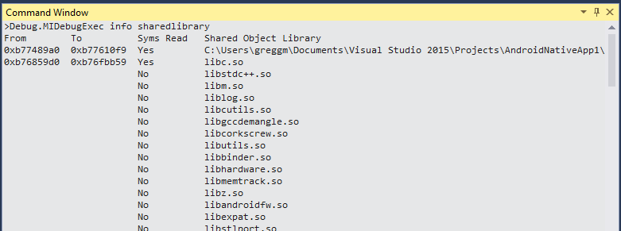

The MIEngine allows sending commands directly to the underlying debugger (gdb/lldb).

To do so:
* View -> Other Windows -> Command Window
* Run: `Debug.MIDebugExe insert-your-gdb-command-here`

Notes:
* This is only supported when the target process is stopped
* Don't run commands that cause the target process to run again. Visual Studio will still be stopped and everything will get very confused.

