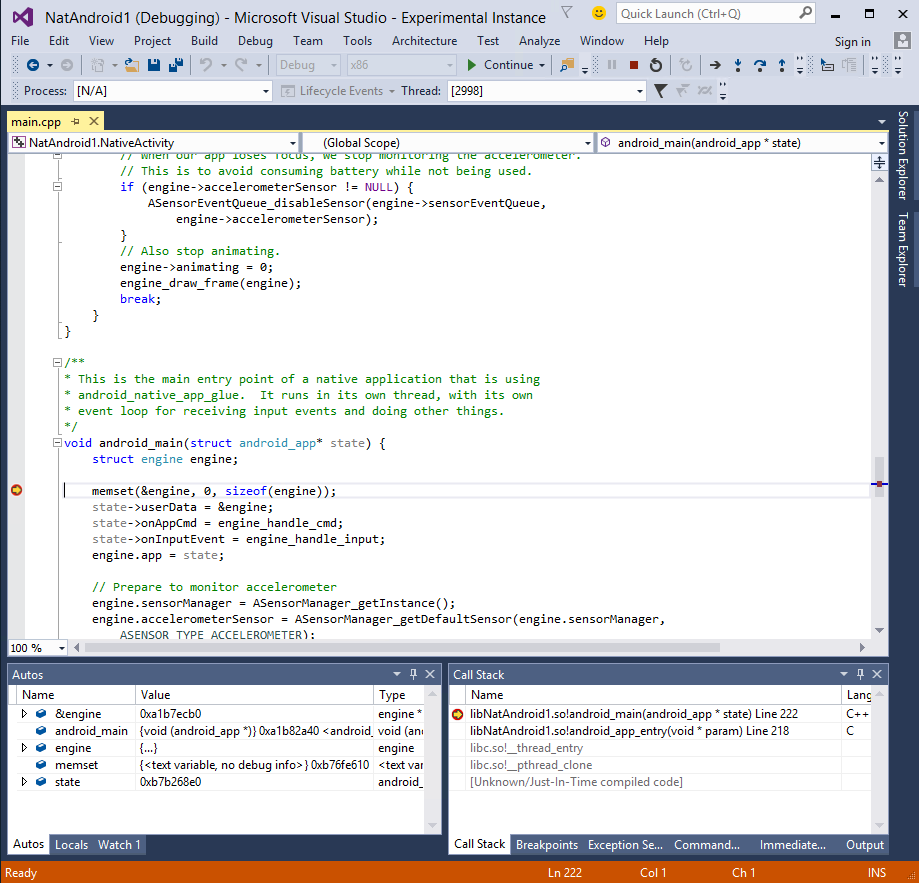

This wiki page will give a quick overview on how you can get started digging into the source code of the MIEngine. In this tutorial, we are going to debug an Android native C++ project, as support for Android is built into Visual Studio. If you are interested in modifying the MIEngine to target some other platform, this tutorial is still probably useful to you so that you can see how to quickly test your code for the Android scenario.

### Setup steps:

1. Install Visual Studio on a real computer (not a VM).

2. Make sure that Android C++ support is enabled in Visual Studio 2015 setup. If you didn't do this or you aren't sure --
    * Open Windows Control Panel
    * Open the Programs and Features applet
    * Find Microsoft Visual Studio 2015 in the list
    * Right click and invoke 'Change'
    * Click the 'Modify' button
    * Make sure these are checked (NOTE: the names were a bit different in Visual Studio 2015 RC, so look around if you are using that build)
        * Programming Languages -> Visual C++ -> Common Tools for Visual C++
        * Cross Platform Mobile Development -> Visual C++ Mobile Development
        * Cross Platform Mobile Development -> Microsoft Visual Studio Emulator for Android
        * Common Tools -> Visual Studio Extensibility Tools

3. If you haven't already done so, clone the MIEngine repository

### Steps:

1. Start your main instance of Visual Studio, and open MIDebugEngine.sln

2. In solution explorer, find the MIDebugEngine project, and open [Engine.Impl\DebuggedProcess.cs](https://github.com/Microsoft/MIEngine/blob/master/src/MIDebugEngine/Engine.Impl/DebuggedProcess.cs)

3. Find the Initialize method of the class, and set a breakpoint

4. Hit F5 to start debugging. This will launch an experimental instance of Visual Studio

5. In The experimental instance:

   1. File -> New Project, Visual C++ -> Cross Platform -> Native-Activity Application (Android)

   2. Open main.cpp from the created project

   3. Set a breakpoint in the android_main method

   4. F5 or Debug -> Start Debugging to start debugging. The Android emulator should startup. This will be slow the first time, but should be subsequently fast

6. Your breakpoint in DebuggedProcess.Initialize will hit. You can step through and see the commands that are being sent to GDB if you like. If you open the output window in your main Visual Studio instance, you can also see all the commands that we sent and the response/events that came back.

7. Hit F5 from this breakpoint and see your experimental instance stop at a breakpoint as well.

